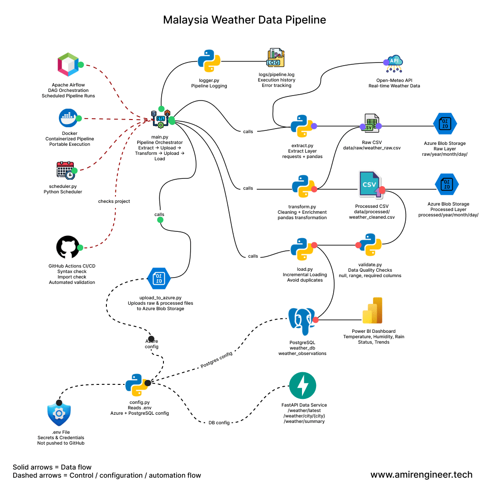

# Malaysia Weather Data Engineering Pipeline

An end-to-end cloud-based data engineering project that extracts real-time weather data from multiple Malaysian cities, transforms the data using Python, stores raw and processed data in Azure Blob Storage, loads structured data into PostgreSQL, and visualizes insights using Power BI.

---

## Project Overview

This project simulates a real-world data engineering workflow involving API ingestion, ETL processing, cloud data lake storage, database loading, scheduling, containerization, and dashboard reporting.

The project was built to demonstrate practical data engineering skills for internship and entry-level data roles.

---

## Pipeline Animation



---

## Architecture

```text
Open-Meteo API
      ↓
Python Extract
      ↓
Raw CSV
      ↓
Azure Blob Storage - Raw Layer
      ↓
Python Transform
      ↓
Processed CSV
      ↓
Azure Blob Storage - Processed Layer
      ↓
PostgreSQL Database
      ↓
Power BI Dashboard
```

## Tech Stack

- Python
- Pandas
- REST API
- Azure Blob Storage
- PostgreSQL
- Docker
- Python Scheduler
- Power BI
- Git & GitHub

## Key Features

- Extracts real-time weather data from multiple Malaysian cities
- Implements an end-to-end ETL pipeline
- Stores raw and processed data in Azure Blob Storage
- Uses partitioned data lake structure by year, month, and day
- Loads processed data into SQLite database
- Includes logging for pipeline monitoring
- Supports automated scheduling
- Containerized using Docker
- Provides dashboard visualization using Power BI

## Data Lake Structure

```
weather-data/
│
├── raw/
│   └── year=2026/month=04/day=29/
│       └── weather_raw_HHMMSS.csv
│
└── processed/
    └── year=2026/month=04/day=29/
        └── weather_cleaned_HHMMSS.csv
```

## Dataset Fields

| Column | Description |
|--------|-------------|
| city | Malaysian city name |
| latitude | City latitude |
| longitude | City longitude |
| temperature_c | Temperature in Celsius |
| humidity_percent | Relative humidity percentage |
| precipitation_mm | Precipitation level |
Malaysia Weather Data Engineering Platform

An end-to-end, production-style data engineering project that ingests real-time weather data from public APIs, processes it through a scalable ETL pipeline, stores it in a cloud-based data lake and relational database, and exposes the data via API and dashboard for analytics.

Project Overview
-------------------
This project simulates a real-world data engineering system, combining batch processing, cloud storage, workflow orchestration, containerization, and data serving into a unified platform. The system is designed to demonstrate practical, industry-relevant data engineering skills suitable for internship and junior data engineering roles.

Architecture
---------------
Open-Meteo API
      ↓
Python Extract (requests)
      ↓
Raw Layer (CSV)
      ↓
Azure Blob Storage (Data Lake - Raw)
      ↓
Transform (pandas)
      ↓
Processed Layer (CSV)
      ↓
Azure Blob Storage (Processed)
      ↓
PostgreSQL Database
      ↓
FastAPI Data Service
      ↓
Power BI Dashboard

Tech Stack
------------
- Python (ETL processing)
- Pandas (data transformation)
- REST API (data ingestion)
- Microsoft Azure Blob Storage (data lake)
- PostgreSQL (relational database)
- FastAPI (data service layer)
- Apache Airflow (workflow orchestration)
- Docker (containerization)
- GitHub Actions (CI/CD)
- Power BI (data visualization)

Key Features
-------------
- End-to-end ETL pipeline (Extract, Transform, Load)
- Cloud-based data lake using Azure Blob Storage
- Partitioned storage structure (year/month/day)
- Data validation and quality checks
- Incremental loading to avoid duplicate records
- PostgreSQL database integration for structured querying
- FastAPI service exposing data via REST endpoints
- Apache Airflow DAG for workflow orchestration
- Docker containerization for reproducibility
- CI/CD pipeline using GitHub Actions
- Interactive dashboard using Power BI

### Data Lake Design

```text
weather-data/
├── raw/
│   └── year=YYYY/month=MM/day=DD/
│       └── weather_raw_timestamp.csv
└── processed/
      └── year=YYYY/month=MM/day=DD/
            └── weather_cleaned_timestamp.csv
```

This partitioning improves scalability, performance, and data retrieval efficiency.

API Endpoints (FastAPI)
-------------------------
Endpoint  | Description
--------- | -------------------------------
/        | API root
/weather/latest | Latest weather records
/weather/city/{city} | Weather by city
/weather/summary | Aggregated weather statistics

Interactive API docs:
http://127.0.0.1:8000/docs

Workflow Orchestration
------------------------
Apache Airflow is used to manage and schedule the pipeline:

- DAG-based execution
- Task monitoring via UI
- Scalable workflow automation

Docker Support
-----------------
Build:

```bash
docker build -t weather-pipeline .
```

Run:

```bash
docker run --env-file .env weather-pipeline
```

CI/CD (GitHub Actions)
-------------------------
Automated workflow includes:

- Dependency installation
- Python syntax validation
- Module import checks

Ensures code quality and pipeline stability on every push.

Dashboard (Power BI)
----------------------
The dashboard provides:

- Temperature comparison by city
- Humidity analysis
- Rain distribution
- Time-based trends
