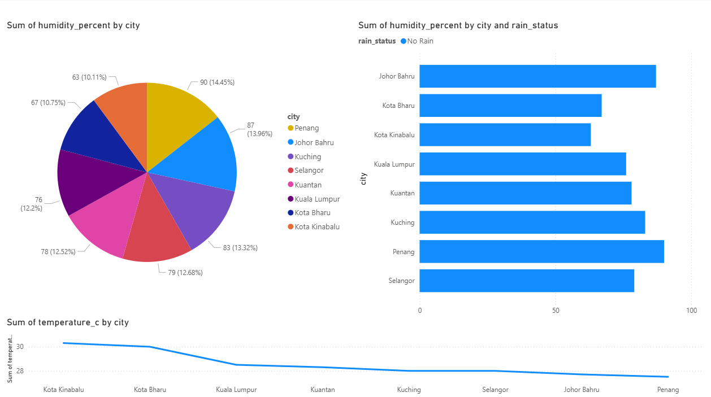

# 🌦️ Malaysia Weather Data Engineering Pipeline

An end-to-end cloud-based data engineering pipeline that extracts real-time weather data from multiple Malaysian cities, processes it using Python, stores data in a partitioned Azure data lake, loads structured data into PostgreSQL, and visualizes insights using Power BI.

## 🚀 Project Overview

This project simulates a production-grade data pipeline, covering:

- API data ingestion
- Data validation (data quality checks)
- Data transformation
- Cloud storage (Azure Blob Storage)
- Incremental database loading
- Workflow automation
- Containerization (Docker)
- Dashboard visualization

## 🧠 Architecture

```text
Open-Meteo API
      ↓
Extract (Python)
      ↓
Validate (Raw Data)
      ↓
Azure Blob Storage (Raw Layer)
      ↓
Transform (Pandas)
      ↓
Validate (Processed Data)
      ↓
Azure Blob Storage (Processed Layer)
      ↓
Incremental Load (PostgreSQL)
      ↓
Power BI Dashboard
```

## 🏗️ Tech Stack

- Python (ETL)
- Pandas
- REST API
- Azure Blob Storage (Data Lake)
- PostgreSQL (Database)
- SQLAlchemy
- Docker
- Python Scheduler
- Power BI
- Git & GitHub

## 🔥 Key Features

- End-to-end ETL pipeline
- Cloud-based data lake using Azure Blob Storage
- Partitioned storage (year/month/day)
- **Data validation** (null checks, range validation, duplicates)
- **Incremental loading** (no duplicate inserts)
- PostgreSQL database integration
- Automated scheduling
- Docker containerization
- Interactive dashboard visualization

## 🧪 Data Validation Layer

Ensures data quality before loading:
- Null value checks
- Range validation (e.g., humidity 0–100)
- Duplicate detection
- Category validation

Example:
```python
assert df["temperature_c"].notnull().all()
assert (df["humidity_percent"] <= 100).all()
```

## ⚡ Incremental Loading (Production Feature)

Instead of reloading all data:
- Only new records are inserted based on `extracted_at` timestamp

SQL logic:
```sql
SELECT MAX(extracted_at) FROM weather_observations;
```

Filtering logic:
```python
df = df[df["extracted_at"] > last_timestamp]
```

✅ Prevents duplicates
✅ Improves efficiency
✅ Production-ready behavior

## 🗄️ Data Lake Structure

```
weather-data/
│
├── raw/
│   └── year=2026/month=05/day=01/
│
└── processed/
    └── year=2026/month=05/day=01/
```

## 🧱 Project Structure

```
malaysia-weather-pipeline/
│
├── data/
├── logs/
├── src/
│   ├── extract.py
│   ├── transform.py
│   ├── validate.py
│   ├── load.py
│   ├── config.py
│   └── upload_to_azure.py
│
├── main.py
├── scheduler.py
├── Dockerfile
├── requirements.txt
└── README.md
```

## ▶️ How to Run

### Local Run
```bash
pip install -r requirements.txt
python main.py
```

### Docker Run
```bash
docker build -t weather-pipeline .
docker run --env-file .env weather-pipeline
```

### Scheduler
```bash
python scheduler.py
```

## 📊 Dashboard

The Power BI dashboard includes:
- Temperature by city
- Humidity analysis
- Rain status distribution
- Time-based trends

📌 Dashboard screenshot:


## ⚠️ Challenges & Solutions

### Docker setup issues (WSL + virtualization)
- Fixed by enabling BIOS virtualization and configuring WSL2
- Debugged Docker backend initialization
- Ensured stable container execution

## 🧠 Skills Demonstrated

- ETL pipeline design
- Data validation & quality assurance
- Cloud data lake architecture
- Incremental data processing
- SQL & PostgreSQL
- Workflow automation
- Docker containerization
- Data visualization

## 📄 Resume Summary

Built a production-ready data pipeline using Python, Azure Blob Storage, and PostgreSQL, implementing ETL processing, data validation, incremental loading, Docker containerization, and Power BI dashboards for real-time weather analytics.

## 🔮 Future Improvements

- Replace scheduler with Apache Airflow
- Use Parquet instead of CSV
- Add CI/CD pipeline (GitHub Actions)
- Deploy to cloud (Azure Container Apps)
- Add real-time streaming pipeline
